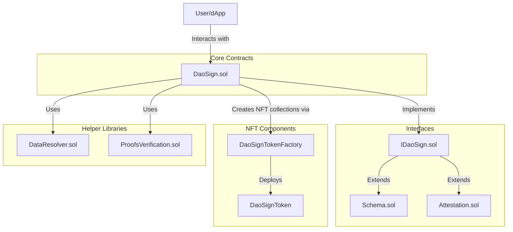
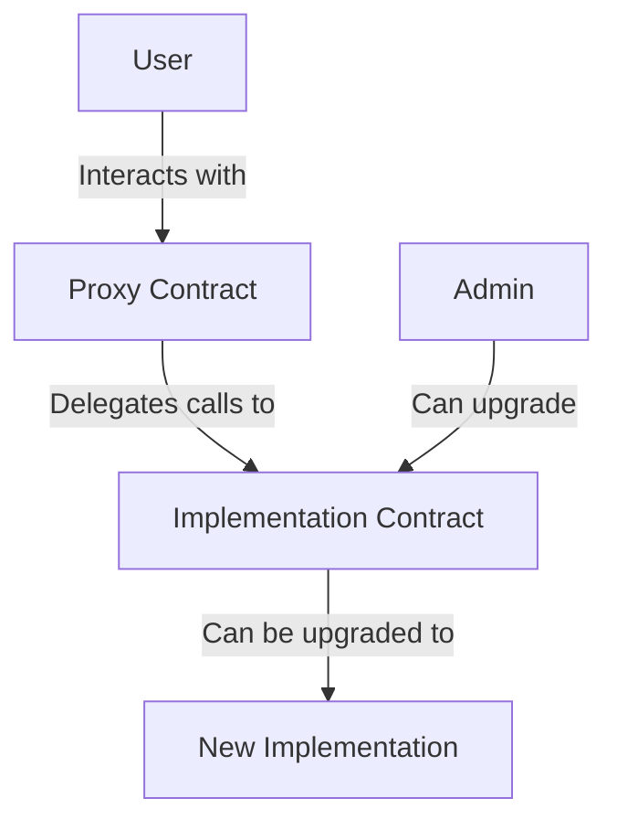
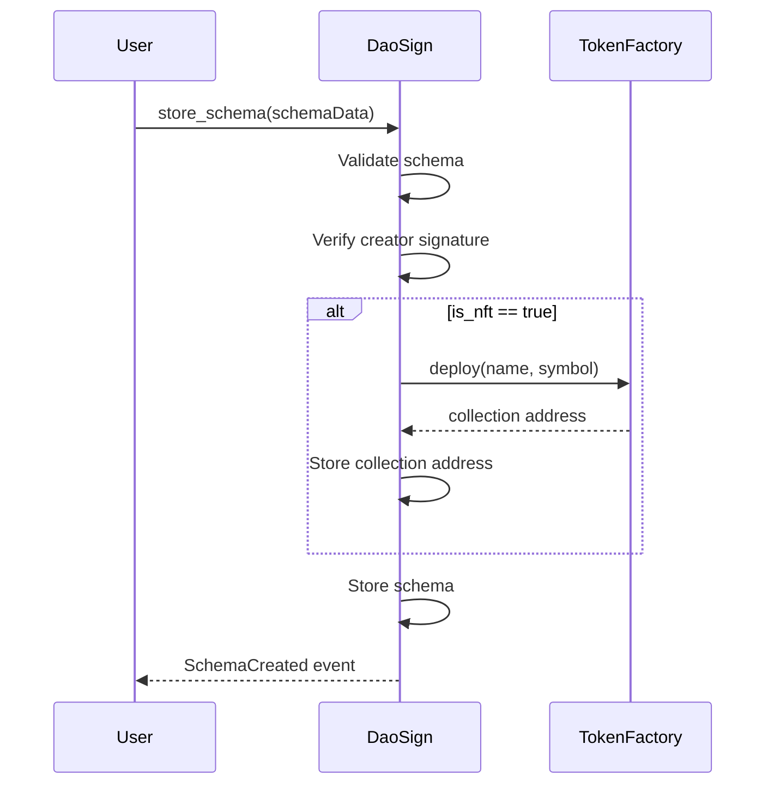
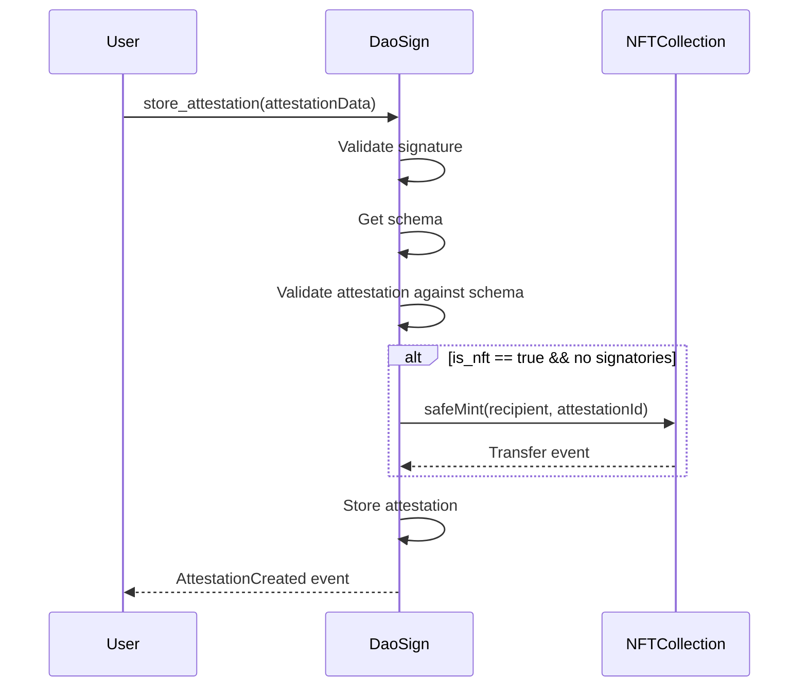
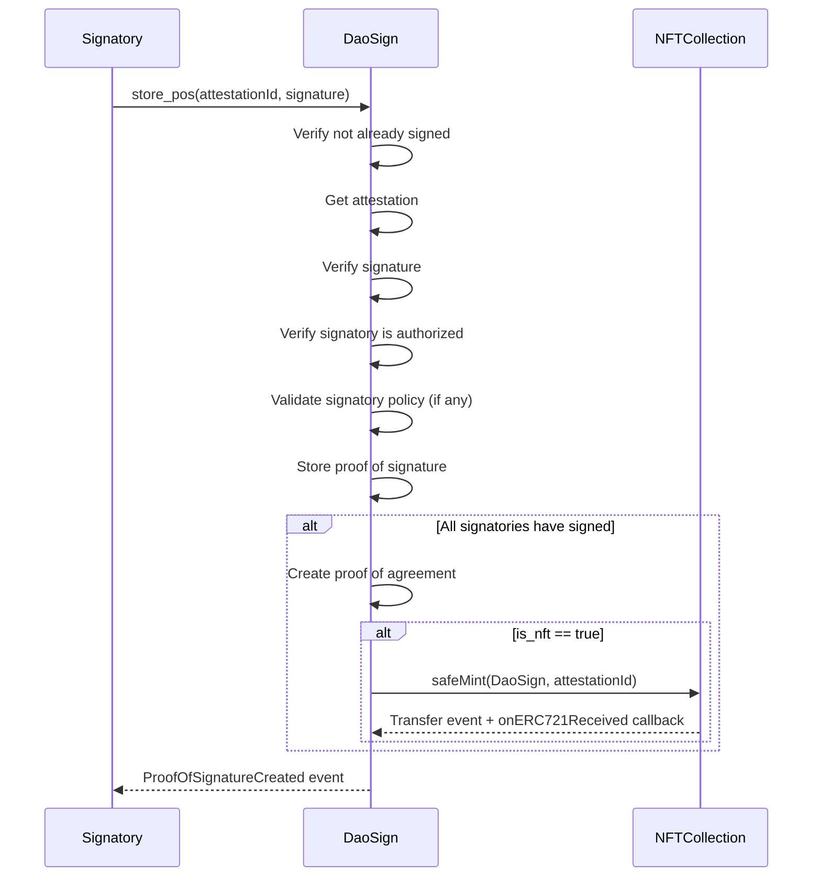
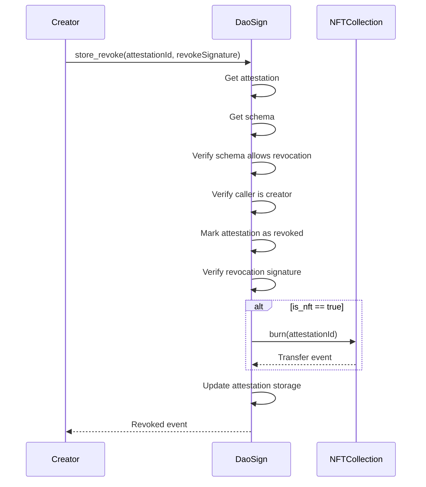

# DaoSign Architecture

DaoSign is built as a modular smart contract system on the Ethereum blockchain. This document provides an overview of the architectural design, components, and interactions within the system.

## System Overview

DaoSign consists of several integrated components:

1. **Core Contracts**: The main contract logic that handles schemas, attestations, and proofs
2. **Interface Contracts**: Structured interfaces that define data structures and function signatures
3. **Token Contracts**: ERC-721 implementation for representing attestations as NFTs
4. **Helper Libraries**: Utilities for data processing and signature verification

## Architectural Diagram



## Core Components

### DaoSign.sol

The main contract that implements the core functionality:

- Creation and management of schemas
- Creation and management of attestations
- Verification of signatures and agreements
- Management of NFT tokens for attestations
- Signature policy verification
- Revocation management

## Data Structures

The protocol uses several primary data structures:

### Schema

```typescript
interface Schema {
  schema_id: uint256;
  metadata: SchemaMetadata;
  signatory_policy: SignatoryPolicy[];
  schema_definition: SchemaDefinition[];
  signature: bytes;
}
```

### Attestation

```typescript
interface Attestation {
  attestation_id: uint256;
  schema_id: uint256;
  attestation_result: AttestationResult[];
  creator: address;
  recipient: address;
  created_at: uint32;
  signatories: address[];
  signature: bytes;
}
```

### Internal Attestation (Extended)

```typescript
interface InternalAttestation {
  // All properties from Attestation, plus:
  is_revoked: boolean;
  revoked_at: uint32;
  revoke_signature: bytes;
}
```

### Proof of Signature

```typescript
interface ProofOfSignature {
  attestation_id: uint256;
  creator: address;
  created_at: uint32;
  signature: bytes;
}
```

### Proof of Agreement

```typescript
interface ProofOfAgreement {
  attestation_id: uint256;
  signatures: bytes[];
}
```

## Upgrade Pattern

DaoSign uses the UUPS (Universal Upgradeable Proxy Standard) pattern for contract upgrades:

- Allows for contract logic to be upgraded while maintaining state
- Provides a standard interface for managing upgrade permissions
- Ensures backward compatibility with existing data



## NFT Integration

DaoSign uses a factory pattern for NFT creation:

1. When a schema with `is_nft = true` is created, a new NFT collection is deployed
2. The collection is specific to that schema
3. When an attestation is created or fully signed, an NFT can be minted
4. If an attestation is revoked, the corresponding NFT is burned

## Processing Flow

### Schema Creation



### Attestation Creation



### Signing Process



### Revocation Process



## Storage Model

DaoSign uses several key mappings for data storage:

```solidity
// Schema storage
mapping(uint256 => InternalSchema) private schema_by_id;

// Attestation storage
mapping(uint256 => InternalAttestation) private attestation_by_id;

// Signatures storage
mapping(uint256 => ProofOfSignature[]) private proofs_of_signature;

// Agreements storage
mapping(uint256 => ProofOfAgreement[]) private proofs_of_agreement;

// Signature status tracking
mapping(uint256 => mapping(address => bool)) private signed_attestation;

// User attestation lookup
mapping(uint256 => mapping(address => InternalAttestation[])) private user_attestations;

// NFT collection tracking
mapping(uint256 => address) public collection_by_schema;
```

## Security Considerations

DaoSign implements several security measures:

1. **Signature Verification**: All operations requiring authorization use cryptographic signatures
2. **Role-Based Access**: Different functions are restricted to specific roles (creator, signatories)
3. **Ownership Control**: Upgrades are restricted to the contract owner
4. **Input Validation**: Extensive validation of inputs to prevent incorrect or malicious data
5. **Signatory Verification**: Ensuring only authorized signatories can sign attestations

## Integration Points

DaoSign provides several integration points for dApps and other systems:

1. **Direct Contract Interaction**: Applications can interact directly with the smart contracts
2. **Events**: The system emits events for all major actions, enabling off-chain systems to track on-chain activity
3. **NFT Standards**: The NFT implementation follows ERC-721 standards for compatibility with wallets and marketplaces
4. **Query Functions**: Various view functions allow querying the state of schemas, attestations, and signatures

## Version Upgrade Process

The DaoSign protocol uses a careful upgrade process:

1. **New Implementation**: Deploy the new implementation contract (e.g., DaoSignV2)
2. **Admin Action**: The owner calls the upgrade function on the proxy
3. **Initialization**: The new implementation is initialized with any new state variables
4. **Version Tracking**: The new version records its version information

This approach ensures that:
- No data is lost during upgrades
- Users experience no service interruption
- New functionality can be added over time
