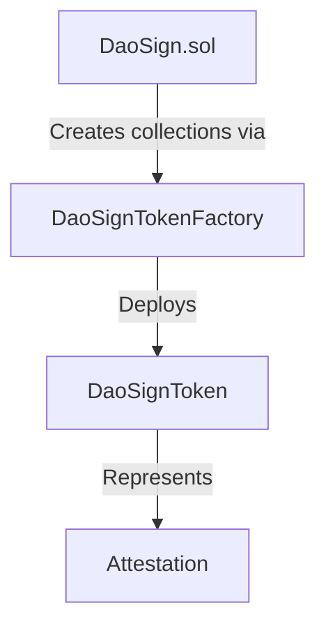

# NFT Token Integration

DaoSign provides the option to represent attestations as ERC-721 NFTs. This approach offers several benefits, including improved visibility, interoperability with existing NFT ecosystems, and simpler verification of attestations through standard token interfaces.

## Token Architecture

DaoSign uses a factory pattern to handle token creation:

1. **DaoSignTokenFactory**: Creates new NFT collections for schemas
2. **DaoSignToken**: Standard ERC-721 implementation with custom minting and burning controls



## DaoSignToken Contract

The `DaoSignToken` is an ERC-721 implementation with specific features for the DaoSign protocol:

```solidity
contract DaoSignToken is ERC721, ERC721Burnable, Ownable {
    // State variables
    address public daosign_protocol;
    
    // Constructor
    constructor(address _owner, string memory _name, string memory _symbol) ERC721(_name, _symbol) Ownable(_owner) {
        daosign_protocol = msg.sender;
    }
    
    // Minting function (only DaoSign can call)
    function safeMint(address to, uint256 tokenId, bytes memory data) public {
        require(msg.sender == daosign_protocol, "Only protocol can mint");
        _safeMint(to, tokenId, data);
    }
    
    // Burning function (only DaoSign can call)
    function burn(uint256 tokenId) public override {
        require(
            msg.sender == daosign_protocol || _isApprovedOrOwner(_msgSender(), tokenId),
            "Not authorized to burn"
        );
        _burn(tokenId);
    }
}
```

Key characteristics:
- Each token represents a specific attestation
- The token ID matches the attestation ID
- Only the DaoSign protocol or token owner can burn tokens
- Only the DaoSign protocol can mint tokens
- Token transfers may be restricted based on the schema definition

## DaoSignTokenFactory Contract

The `DaoSignTokenFactory` is responsible for deploying new token collections:

```solidity
contract DaoSignTokenFactory {
    // Event for tracking deployments
    event CollectionDeployed(address collection, string name, string symbol);
    
    // Deployment function
    function deploy(address owner, string memory name, string memory symbol) external returns (address) {
        DaoSignToken token = new DaoSignToken(owner, name, symbol);
        emit CollectionDeployed(address(token), name, symbol);
        return address(token);
    }
}
```

Key functions:
- Deploys new DaoSignToken contracts with specified names and symbols
- Assigns ownership to the DaoSign contract
- Returns the address of the new token collection
- Emits events to track deployments

## Token Minting Process

Tokens are minted in two different scenarios:

### 1. Immediate Minting

When creating an attestation that doesn't require signatures:

```solidity
function store_attestation(Attestation memory input_attestation) external {
    // ... validation and processing ...
    
    // For schemas with NFTs but no signatures required
    if (s.metadata.is_nft && s.signatory_policy.length == 0 && a.recipient != address(0))
        _mint_token(a.recipient, a.attestation_id, a.schema_id);
    
    // ... more processing ...
}

function _mint_token(address to, uint256 _token_id, uint256 _schema_id) private {
    address collection = collection_by_schema[_schema_id];
    DaoSignToken(collection).safeMint(to, _token_id, "");
}
```

This happens when:
- The schema has NFT support enabled (`is_nft = true`)
- The schema doesn't require signatures (empty `signatory_policy`)
- A valid recipient is specified

### 2. Post-Signature Minting

When all required signatures are collected:

```solidity
function _store_poa(InternalAttestation memory a, InternalSchema memory s) private {
    // ... processing signatures ...
    
    if (s.metadata.is_nft) _mint_token(address(this), a.attestation_id, a.schema_id);
    
    // ... more processing ...
}

function onERC721Received(address, address, uint256 tokenId, bytes calldata) external override returns (bytes4) {
    emit ProofOfAgreementCreated(tokenId);
    return this.onERC721Received.selector;
}
```

This happens when:
- The schema has NFT support enabled (`is_nft = true`)
- All required signatures have been collected
- A proof of agreement is created

## Token Burning Process

Tokens are burned when attestations are revoked:

```solidity
function store_revoke(uint256 _attestation_id, bytes memory revoke_signature) external {
    // ... validation and processing ...
    
    // Burn NFT if present
    if (s.metadata.is_nft && s.signatory_policy.length == 0) _burn_token(a.attestation_id, a.schema_id);
    
    // ... more processing ...
}

function _burn_token(uint256 _attestation_id, uint256 _schema_id) private {
    address collection = collection_by_schema[_schema_id];
    DaoSignToken(collection).burn(_attestation_id);
}
```

This happens when:
- The attestation is being revoked
- The schema has NFT support enabled (`is_nft = true`)
- The attestation has an associated token

## Schema Configuration for NFTs

To enable NFT support for a schema, configure its metadata:

```typescript
const nftEnabledSchema = {
    metadata: {
        name: "Certification",
        description: "Professional certification document",
        attestation_type: "certification",
        // NFT-specific fields
        is_nft: true,
        nft_name: "Professional Certificates",
        nft_symbol: "CERT",
        // Other metadata
        creator: creatorAddress,
        is_public: true,
        is_revokable: true,
        expire_in: 31536000 // 1 year in seconds
    },
    // ... schema definition and other fields ...
};
```

Required NFT configuration:
- `is_nft: true` to indicate NFT support
- `nft_name` to specify the collection name
- `nft_symbol` to specify the token symbol

## Token Metadata and URI

The DaoSignToken contract follows the ERC-721 standard for metadata handling. Token URIs can be customized to provide rich metadata about the attestation, including:

- Attestation type and schema information
- Creation timestamp and status
- Signatory information (when appropriate)
- Link to the full attestation data

## Using Tokens for Verification

DaoSign NFTs serve as on-chain proof that an attestation exists and is valid. Third-party systems can verify attestations by:

1. Checking token ownership
2. Querying the DaoSign contract for full attestation details
3. Verifying that the attestation hasn't been revoked

## Implementation Considerations

When implementing NFT support:

- **Privacy**: Consider what data should be publicly accessible in token metadata
- **Transferability**: Determine whether tokens should be transferable or bound to specific addresses
- **Visibility**: Balance between on-chain and off-chain data storage
- **Integration**: Plan for integration with wallets, marketplaces, and other NFT systems

## Examples

### Creating an NFT-Enabled Schema

```javascript
// JavaScript example (web3.js or ethers.js)
const certificationSchema = {
    metadata: {
        name: "Professional Certification",
        description: "Verify professional qualifications",
        attestation_type: "certification",
        nft_name: "Professional Certificates",
        nft_symbol: "CERT",
        creator: myAddress,
        created_at: Math.floor(Date.now() / 1000),
        is_nft: true,
        is_public: true,
        is_revokable: true,
        expire_in: 60 * 60 * 24 * 365 // 1 year in seconds
    },
    schema_definition: [
        { definition_type: "string", definition_name: "Certification Name" },
        { definition_type: "string", definition_name: "Recipient Name" },
        { definition_type: "uint256", definition_name: "Issue Date" },
        { definition_type: "uint256", definition_name: "Expiration Date" },
        { definition_type: "string", definition_name: "Issuing Authority" }
    ],
    signatory_policy: [
        {
            operator: "0x01", // AND
            signatory_description: "Authorized Certifier",
            required_schema_id: [1] // Schema ID for "Certifier Authority"
        }
    ],
    signature: creatorSignature
};

// Create schema on blockchain
const tx = await daoSignContract.store_schema(certificationSchema);
const receipt = await tx.wait();

// Get schema ID from event
const schemaId = receipt.events
    .find(e => e.event === 'SchemaCreated')
    .args.schemaID;

console.log(`Created schema with ID: ${schemaId}`);
console.log(`NFT Collection address: ${await daoSignContract.collection_by_schema(schemaId)}`);
```

### Checking Token Status

```javascript
// JavaScript example
async function verifyAttestation(attestationId) {
    // Get the schema ID for this attestation
    const attestation = await daoSignContract.validate_and_get_attestation(attestationId);
    const schemaId = attestation.schema_id;
    
    // Get the token collection address
    const collectionAddress = await daoSignContract.collection_by_schema(schemaId);
    
    // Create token contract instance
    const tokenContract = new ethers.Contract(
        collectionAddress,
        DaoSignTokenABI,
        provider
    );
    
    try {
        // Check if token exists and who owns it
        const owner = await tokenContract.ownerOf(attestationId);
        console.log(`Attestation ${attestationId} is valid and owned by ${owner}`);
        
        // Check if attestation is revoked
        if (attestation.is_revoked) {
            console.log(`Warning: Attestation ${attestationId} has been revoked`);
            return false;
        }
        
        return true;
    } catch (error) {
        // Token doesn't exist or has been burned
        console.log(`Attestation ${attestationId} is not valid or has been revoked`);
        return false;
    }
}
```
